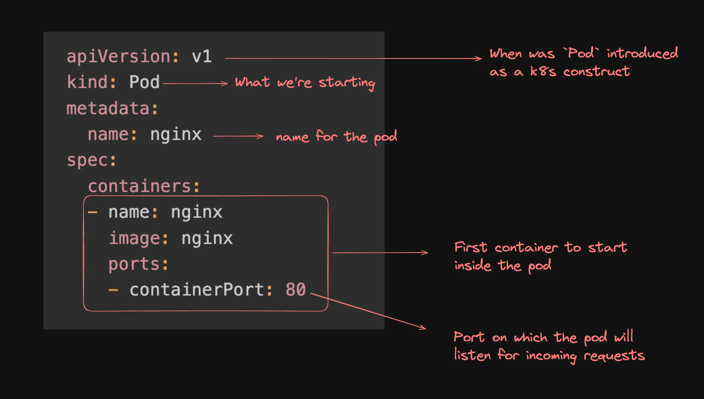

Cluster
├── Node 1
│   ├── Pod A
│   │   └── Container (nginx)
│   └── Pod B
│       └── Container (redis)
├── Node 2
│   └── Pod C
│       └── Container (postgres)
└── Node 3
    └── (Idle or other pods)

Deployment manages replica sets which manages a bunch of pods

